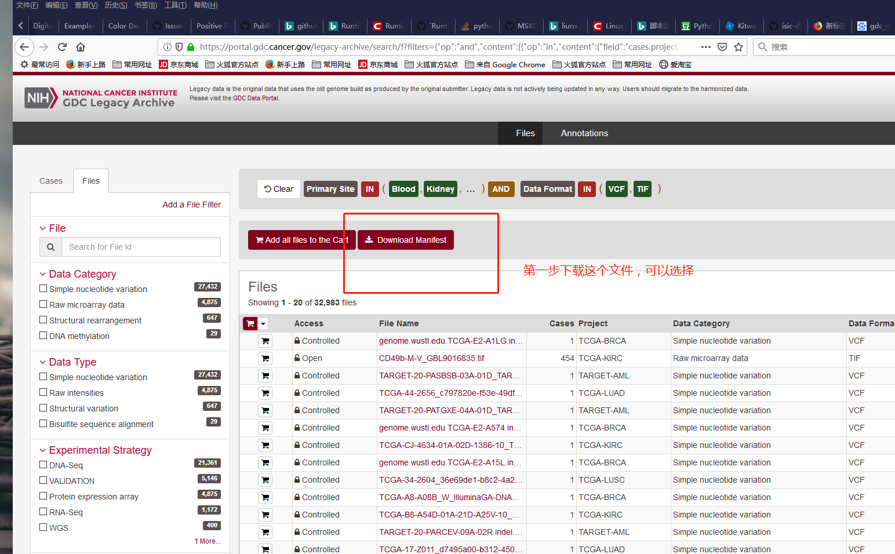

## TCGA数据的py脚本

### 使用

1. 下载manidest文件，这个文件主要提供在网页上选择的癌症类型，文件种类等信息的链接数据

具体，访问：https://portal.gdc.cancer.gov/  不同浏览器打开可能会有差异；

可以在左侧选择栏目里选择各种信息。点击 Download Manifest

会下载一个manifest----.txt文件；(其中----表示日期)

2. 运行 python download.py -h  会有参数说明：

-m 输入 manifest文件目录

-s 输入数据保存位置

3. 运行就可以，下载过程中会有断链接情况，支持断点下载

程序中断后，可以重新启动，程序将在最后下载文件后下载文件。注意，此下载工具将过去文件夹格式的文件直接转换为txt文件。文件名是原始TCGA中文件的UUID。如有必要，按ctrl+c终止程序。
## 感谢

朋友帮助，提供这个脚本，方便更新数据。

